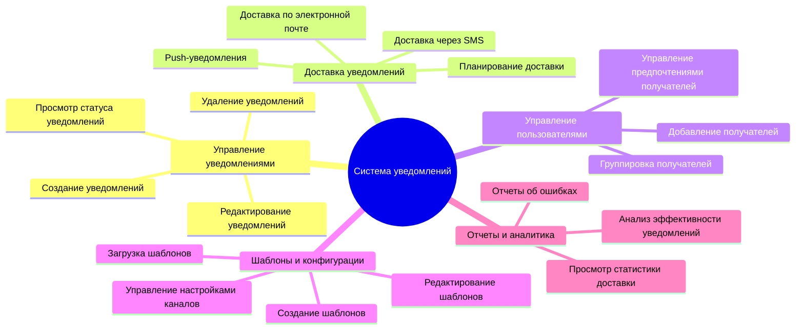
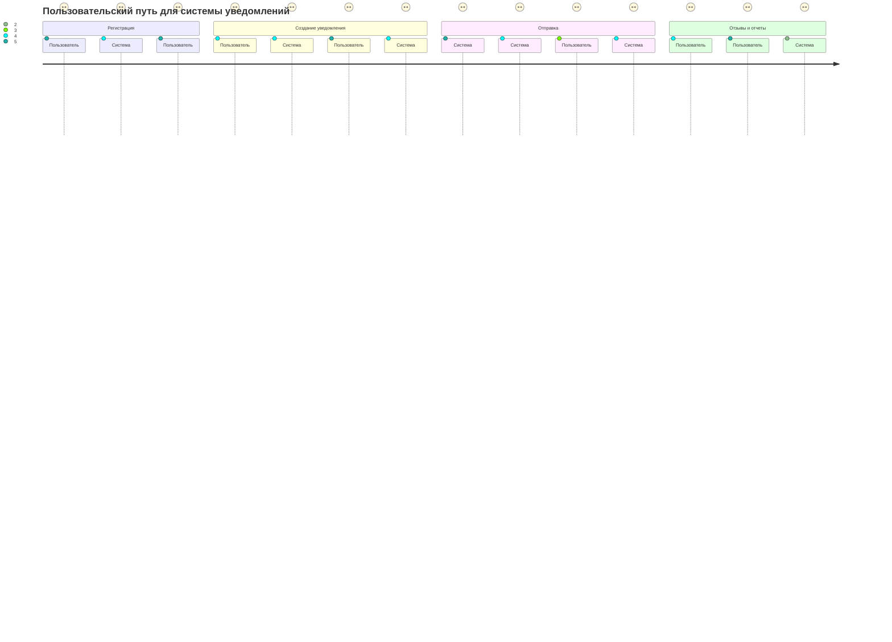
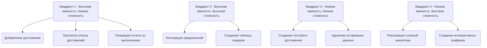
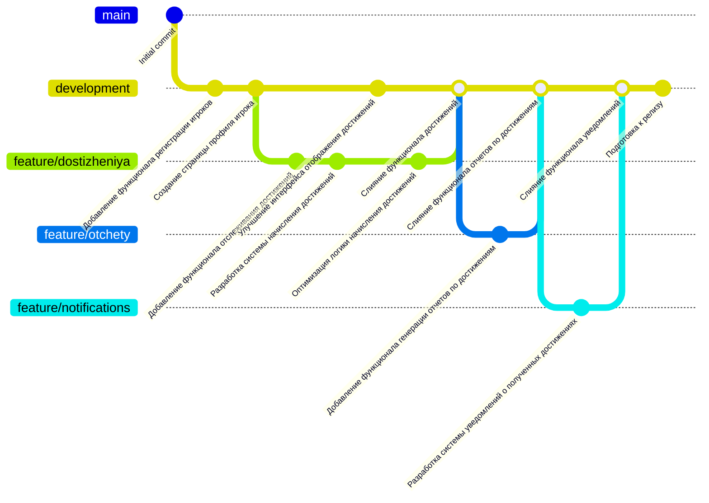

В данной схеме описана MindMap диаграмма для клиент-серверной системы достижений в онлайн игре

В данной схеме описана User Journey Diagram

В данной схеме описан квадрант-граф 

В данной схеме описан гит-граф
