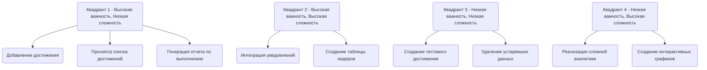

```mermaid

graph TD

    A1(Квадрант 1 - Высокая важность, Низкая сложность)

    A2(Квадрант 2 - Высокая важность, Высокая сложность)

    A3(Квадрант 3 - Низкая важность, Низкая сложность)

    A4(Квадрант 4 - Низкая важность, Высокая сложность)

    A1 --> B1(Добавление достижения)

    A1 --> B2(Просмотр списка достижений)

    A1 --> B3(Генерация отчета по выполнению)

    A2 --> C1(Интеграция уведомлений)

    A2 --> C2(Создание таблицы лидеров)

    A3 --> D1(Создание тестового достижения)

    A3 --> D2(Удаление устаревших данных)

    A4 --> E1(Реализация сложной аналитики)

    A4 --> E2(Создание интерактивных графиков)

```

	