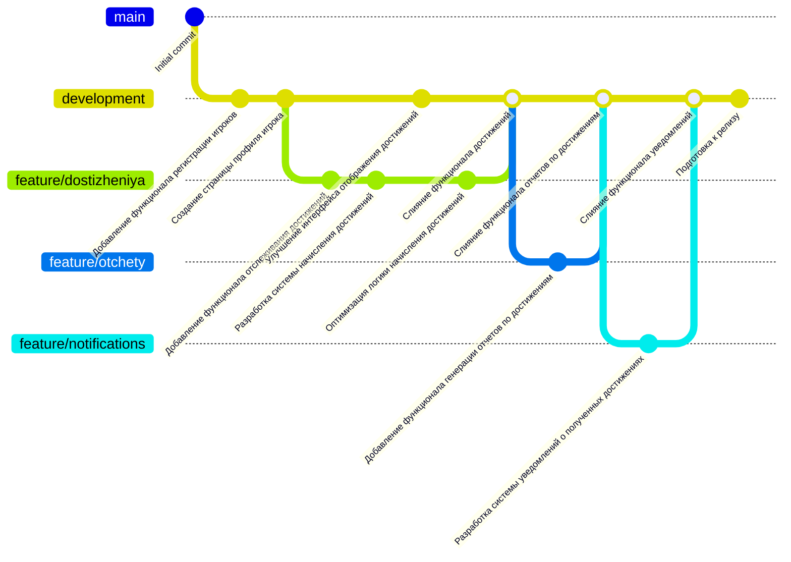

```mermaid
gitGraph
    commit id: "Initial commit"
    
    branch development
    commit id: "Добавление функционала регистрации игроков"
    commit id: "Создание страницы профиля игрока"

    branch feature/dostizheniya
    commit id: "Добавление функционала отслеживания достижений"
    commit id: "Разработка системы начисления достижений"
    checkout development
    commit id: "Улучшение интерфейса отображения достижений"
    
    checkout feature/dostizheniya
    commit id: "Оптимизация логики начисления достижений"
    checkout development
    
    merge feature/dostizheniya id: "Слияние функционала достижений"
    
    branch feature/otchety
    commit id: "Добавление функционала генерации отчетов по достижениям"
    checkout development
    
    merge feature/otchety id: "Слияние функционала отчетов по достижениям"
    
    branch feature/notifications
    commit id: "Разработка системы уведомлений о полученных достижениях"
    checkout development
    
    merge feature/notifications id: "Слияние функционала уведомлений"
    
    commit id: "Подготовка к релизу"
```
